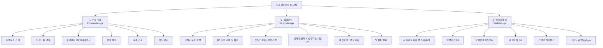

# 🌐 강의하는아이들(gang-a.kr) LMS 전체 사이트맵 및 엔드포인트 규격서
> **대상 독자**: zero-context subagents, 새 세션 Lead 에이전트, 자동화 스크립트 개발자  
> **기준 지점**: 강의하는아이들 대치점 (`https://dc.gang-a.kr`)  
> **최종 갱신일**: 2026-08-19

---

## 📌 1. 기본 접속 및 인증 체계 (Authentication & Session)

- **Base URL**: `https://dc.gang-a.kr`
- **정적/PDF 스토리지**: `https://storage.studyq.net`
- **인증 방식**: Cookie 기반 세션 인증 (`JSESSIONID`)
- **공통 필수 파라미터 / 히든 필드**:
  - `fran_no`: 가맹점 번호 (대치점: `1680`)
  - `pri_no`: 교사 고유 번호 (예: `1292923`)
  - `mem_type`: 회원 구분 (`1`: 강사)
- **세션 검증 엔드포인트**:
  - `GET /servlet/controller.tutor.TutorMenuIndexServlet?p_process=CourseManageIndex`
  - 세션 만료 시 응답 본문에 `"normal_session_error"` 포함됨.

---

## 📂 2. 주요 3대 탭(Tab) 사이트 맵

---

## 🛠️ 3. 탭별 상세 엔드포인트 및 파라미터 규격

### 📋 [1] 수업관리 탭 (Class Management)

| 메뉴명 | URL / Servlet | Method | 주요 파라미터 및 설명 |
| :--- | :--- | :---: | :--- |
| **메인 인덱스** | `/servlet/controller.tutor.TutorMenuIndexServlet?p_process=CourseManageIndex` | GET | 수업관리 메인 진입 |
| **수업일정 관리** | `/servlet/controller.cct.tutor.CourseScheduleServlet?p_process=Main` | GET | 요일별/교시별 담당 학생 학반 스케줄 테이블 |
| **학생그룹 관리** | `/servlet/controller.cct.tutor.CourseGroupServlet?p_process=Main` | GET/POST | 학반(그룹) 생성, 수정, 삭제 |
| **수업일지 (메인)** | `/servlet/controller.cct.tutor.DayRecordServlet?p_process=Main` | GET/POST | 당일 출석 학생 진도/숙제/데일리리포트 작성/단축URL 생성 |
| **날짜별 일지** | `/servlet/controller.cct.tutor.DayRecordServlet?p_process=DaysMain` | GET | 과거/특정 날짜별 수업일지 조회 |
| **학생 배정** | `/servlet/controller.cct.tutor.CourseMemberServlet?p_process=Main` | GET/POST | 반별 학생 등록 및 배정 |
| **출결 조회** | `/servlet/controller.cct.tutor.AttendanceServlet?p_process=Main` | GET | 학생별 출결/지각/결석 이력 테이블 |
| **상담 관리** | `/counsel/csl_student_list.jsp` | GET | 학부모 상담 이력 조회 및 등록 팝업 |

---

### 📖 [2] 학습관리 탭 (Study Management)

| 메뉴명 | URL / Servlet | Method | 주요 파라미터 및 설명 |
| :--- | :--- | :---: | :--- |
| **메인 인덱스** | `/servlet/controller.tutor.TutorMenuIndexServlet?p_process=CourseMainIndex` | GET | 학습관리 메인 진입 |
| **교재리포트 생성** | `/servlet/controller.coursemanage.TextBookManageServlet?reqCmd=getTextBookMain` | GET/POST | 학생별 교재 진도 리포트 생성 (`student_name` 검색) |
| **DT / ZT 출제목록** | `/servlet/controller.dailyzerotest.DailyZeroTestServlet?reqCmd=DailyZeroTestMain` | GET/POST | Daily Test / Zero Test 출제 상태 조회 및 시험지 생성 |
| **DT / ZT 채점결과** | `/servlet/controller.dailyzerotest.DailyZeroTestServlet?reqCmd=DailyZeroTestResult` | GET/POST | 학생별 DT/ZT 응시 점수 및 오답 채점 결과 조회 |
| **진도현황표** | `/servlet/controller.coursemanage.CourseManageServlet?reqCmd=StudyMain` | GET | 학생별 전체 진도표 종합 요약 |
| **개념학습 진도현황** | `/servlet/controller.coursemanage.CourseManageServlet?reqCmd=StudyPro` | GET | 개념 동영상 및 패스 여부 진도율 조회 |
| **학생별 진도현황** | `/servlet/controller.coursemanage.CourseManageServlet?reqCmd=StudySchedule` | GET | 학생별 상세 진도 스케줄러 |
| **학생별 학습과정** | `/servlet/controller.coursemanage.CourseManageServlet?reqCmd=StudyCourse` | GET | 학생별 커리큘럼(초등/중등/고등) 배정 및 변경 |
| **학습통과내역** | `/servlet/controller.coursemanage.CourseManageServlet?reqCmd=CourseStudyManager` | GET | 개념/예제 패스 통과 상세 내역 조회 |
| **교재정답지 & 일일학습 (초등)** | `/servlet/controller.coursemanage.CourseManageServlet?reqCmd=GaStudyAnswer&grade=elementary` | GET | 초등 다빈치/시그마 전 학년 답지/Daily/정오표/샘플 PDF 링크 |
| **교재정답지 & 일일학습 (중등)** | `/servlet/controller.coursemanage.CourseManageServlet?reqCmd=GaStudyAnswer&grade=middle` | GET | 중등 가우스/시그마 전 학년 답지/Daily/정오표/샘플 PDF 링크 |
| **교재정답지 & 일일학습 (고등)** | `/servlet/controller.coursemanage.CourseManageServlet?reqCmd=GaStudyAnswer&grade=high` | GET | 고등 시그마/가우스/수직선/내신대비 답지/Daily/정오표 PDF 링크 |
| **예습 확인** | `/servlet/controller.coursemanage.CourseManageServlet?reqCmd=WebUnPreStudy` | GET | 학생별 미완료 예습 목록 조회 |
| **예습영상 제출현황** | `/servlet/controller.coursemanage.CourseManageServlet?reqCmd=TeacherPrestudySummary` | GET | 설명 촬영 영상 제출 및 피드백 현황 |
| **알림톡 발송** | `/servlet/controller.appui.alimtalk.AlimtalkServlet?p_process=AlimtalkList` | GET/POST | 학부모 카카오 알림톡 발송 이력 및 전송 |

---

### 📝 [3] 문제지제작 탭 (Test Pool & Exam Maker)

| 분류 | 메뉴명 | URL / Servlet | Method | 주요 설명 |
| :--- | :--- | :--- | :---: | :--- |
| **e-Test Pool** | **문제지 풀 조회** | `/servlet/controller.tutor.etest.TestPoolServlet?reqCmd=Main` | GET | 제작된 e-Test 문제지 보관함 |
| | **문제지 제작기** | `/common/etest_pool.jsp` | GET (Popup) | 단원별 문항 추출 및 시험지 생성 마법사 |
| | **출제 이력조회** | `/servlet/controller.tutor.etest.TestPoolServlet?reqCmd=LogViewList` | GET | 학생/반별 출제 로그 확인 |
| **형성평가 (FA)** | **새로 만들기** | `/servlet/controller.tutor.fa.TestPageRegServlet?p_process=Auto` | GET/POST | 형성평가 자동 출제 |
| | **시험지 목록/출제** | `/servlet/controller.tutor.fa.TestPageListGrpServlet?p_process=Main` | GET | 생성된 형성평가 시험지 목록 및 학생 배정 |
| | **시험별 결과** | `/servlet/controller.tutor.fa.TestPageListServlet` | GET | 형성평가 회차별 응시 결과 |
| | **기간별 결과** | `/servlet/controller.tutor.fa.MarksResultDigestServlet?p_process=Main` | GET | 기간 지정 성적 분석 |
| | **학생별 결과** | `/servlet/controller.tutor.base.TestPageListServlet?p_process=UserByMain&ass_no=1001` | GET | `ass_no=1001` (형성평가 코드) |
| **학력인증평가 (DA)**| **새로 만들기** | `/servlet/controller.tutor.da.TestPageRegServlet?p_process=Auto` | GET/POST | 학력인증평가(월간/누적) 시험지 생성 |
| | **시험지 목록/출제** | `/servlet/controller.tutor.da.TestPageListGrpServlet?p_process=Main` | GET | 학력인증평가 시험지 풀 및 인쇄/배정 |
| | **학생별 결과** | `/servlet/controller.tutor.base.TestPageListServlet?p_process=UserByMain&ass_no=1000` | GET | `ass_no=1000` (학력인증평가 코드) |
| **신입생 진단평가** | **시험지 목록** | `/servlet/controller.tutor.diag.DiagnostManageServlet?reqCmd=TestPaperList` | GET | 입학 진단평가 시험지 목록 |
| | **시험 결과** | `/servlet/controller.tutor.diag.DiagnostManageServlet?reqCmd=TestResultList` | GET | 신입생 레벨테스트 결과표 |
| **총괄평가 (NA)** | **시험지 목록/출제** | `/servlet/controller.tutor.na.TestPageListOurclgServlet?p_process=Main` | GET | 본원/지점 총괄평가 목록 |
| | **학생별 결과** | `/servlet/controller.tutor.base.TestPageListServlet?p_process=UserByMain&ass_no=1002` | GET | `ass_no=1002` (총괄평가 코드) |
| **스마트북 (Workbook)**| **스마트북 관리** | `/servlet/controller.tutor.wb.WorkbookManageServlet?p_process=Main` | GET/POST | 커스텀 스마트 워크북 목록 및 발행 |
| | **스마트북 결과** | `/servlet/controller.tutor.wb.WbTeachList1Servlet?p_process=SmartBookResultMain` | GET | 스마트북 학습 채점 및 통계 |

---

## 📚 4. 교재 체계 및 스토리지 다운로드 URL 규칙

강의하는아이들의 모든 공식 교재 정답지 및 자료는 `https://storage.studyq.net/data/answer/...` 규칙으로 직접 배포됩니다.

### 🏷️ 초등 다빈치(DaVinci) 교재 체계 (초1 ~ 초6)
- **개념연산 (시그마)**: `g{학년}_sigma_answer.pdf`
- **다빈치 기본**: `g{학년}_basic_answer.pdf` (합본), `g{학년}_basic_daily.pdf`, `g{학년}_basic_repair.pdf`
- **다빈치 발전**: `g{학년}_develop_answer.pdf` (합본), `g{학년}_develop_daily.pdf`, `g{학년}_develop_repair.pdf`
- **다빈치 심화**: `g{학년}_ability_answer.pdf` (합본), `g{학년}_ability_daily.pdf`, `g{학년}_ability_repair.pdf`
- **다빈치 최상위**: `g{학년}_highest_answer.pdf` (합본), `g{학년}_highest_repair.pdf`
- **단원마무리 하부르타**: `g{학년}_basic_havruta_answer_{학기}_{권}.pdf`
- **스마트북(워크북)**: `https://storage.studyq.net/data/answer/el/workbook/g{학년}_{레벨}_answer.pdf`

---

## 🎯 5. "5-1 다빈치 수학" 레벨별 정답지 직접 다운로드 일람표

| 교재 레벨 / 종류 | 권수 / 구분 | 다운로드 파일명 | 직접 다운로드 URL |
| :--- | :--- | :--- | :--- |
| **5-1 다빈치 기본** | 1~3권 전권 합본 (정답) | `g5_basic_answer.pdf` (11.5 MB) | `https://storage.studyq.net/data/answer/el/book/g5_basic_answer.pdf` |
| | 데일리 테스트 정답 | `g5_basic_daily.pdf` | `https://storage.studyq.net/data/answer/el/book/g5_basic_daily.pdf` |
| | 정오표 | `g5_basic_repair.pdf` | `https://storage.studyq.net/data/answer/el/book/g5_basic_repair.pdf` |
| | 5-1 2권 샘플교재 | `g5_basic_sample_1_2.pdf` | `https://storage.studyq.net/data/answer/el/book/g5_basic_sample_1_2.pdf` |
| **5-1 다빈치 발전** | 1~2권 전권 합본 (정답) | `g5_develop_answer.pdf` (7.3 MB) | `https://storage.studyq.net/data/answer/el/book/g5_develop_answer.pdf` |
| | 데일리 테스트 정답 | `g5_develop_daily.pdf` | `https://storage.studyq.net/data/answer/el/book/g5_develop_daily.pdf` |
| | 정오표 | `g5_develop_repair.pdf` | `https://storage.studyq.net/data/answer/el/book/g5_develop_repair.pdf` |
| | 5-1 2권 샘플교재 | `g5_develop_sample_1_2.pdf` | `https://storage.studyq.net/data/answer/el/book/g5_develop_sample_1_2.pdf` |
| **5-1 다빈치 심화** | 1~2권 전권 합본 (정답) | `g5_ability_answer.pdf` (4.1 MB) | `https://storage.studyq.net/data/answer/el/book/g5_ability_answer.pdf` |
| | 데일리 테스트 정답 | `g5_ability_daily.pdf` | `https://storage.studyq.net/data/answer/el/book/g5_ability_daily.pdf` |
| | 정오표 | `g5_ability_repair.pdf` | `https://storage.studyq.net/data/answer/el/book/g5_ability_repair.pdf` |
| | 5-1 2권 샘플교재 | `g5_ability_sample_1_2.pdf` | `https://storage.studyq.net/data/answer/el/book/g5_ability_sample_1_2.pdf` |
| **5-1 다빈치 최상위** | 전권 합본 (정답) | `g5_highest_answer.pdf` (11.0 MB) | `https://storage.studyq.net/data/answer/el/book/g5_highest_answer.pdf` |
| | 정오표 | `g5_highest_repair.pdf` | `https://storage.studyq.net/data/answer/el/book/g5_highest_repair.pdf` |
| **5-1 단원마무리 하부르타** | 5-1 2권 전용 정답지 | `g5_basic_havruta_answer_1_2.pdf` (2.6 MB) | `https://storage.studyq.net/data/answer/el/book/g5_basic_havruta_answer_1_2.pdf` |
| | 5-1 2권 본문 샘플 | `g5_basic_havruta_1_2.pdf` | `https://storage.studyq.net/data/answer/el/book/g5_basic_havruta_1_2.pdf` |
| **5학년 스마트 워크북** | 기본 워크북 정답 | `g5_basic_answer.pdf` (2.5 MB) | `https://storage.studyq.net/data/answer/el/workbook/g5_basic_answer.pdf` |
| | 발전 워크북 정답 | `g5_develop_answer.pdf` (3.7 MB) | `https://storage.studyq.net/data/answer/el/workbook/g5_develop_answer.pdf` |
