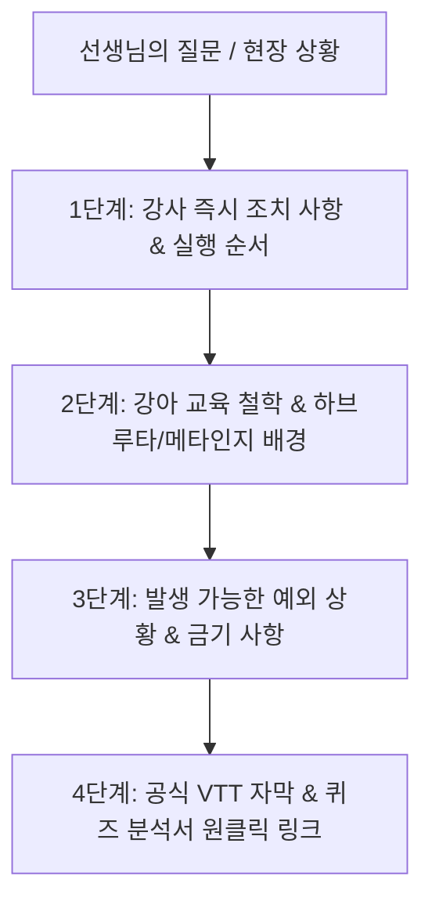

# 🧭 강의하는아이들 강사 전용 실무 운영 핸드북 & 질의응답 프로토콜 (Teacher Operating Protocol)

본 문서는 선생님께서 **강의하는아이들**에서 근무하시며 마주하는 모든 실무 상황(수업 전·중·후, 학생 지도, 시스템 조작, 학부모 상담 등)에 대해 최적의 판단과 행동 지침을 즉시 확인하실 수 있도록 정립한 **강사 전용 표준 질의응답 프로토콜**입니다.

---

## 🎯 1. 질의응답 기본 답변 원칙 (Response Principles)

선생님께서 질문을 주실 때마다 AI 어시스턴트는 아래 4단계 표준 구조에 따라 **"강사로서 무엇을 해야 하는지"**를 가장 정확하고 원리적으로 안내합니다.

---

## 📋 2. 표준 답변 4단계 구성 상세

### **① [Action] 강사의 구체적 실행 지침 (Step-by-Step)**
- **정의**: 교사가 지금 당장 실행해야 하는 행동 및 시스템 조작 순서.
- **포함 내용**:
  - 교재/노트/앱/학습사이트에서 클릭해야 할 메뉴 경로
  - 학생을 대상으로 진행해야 하는 정확한 발문 및 확인 순서
  - 수업일지 및 상담 기록 처리 방법

### **② [Philosophy] 교육 철학 및 메타인지·하브루타 원리**
- **정의**: 왜 이렇게 지도해야 하는지에 대한 본사 교육 철학적 배경.
- **포함 내용**:
  - 주입식 티칭(일방적 설명) 배격 및 소크라테스식 발문 코칭 이유
  - 4단계 개념학습(정독 ➔ 발문자답 ➔ 코넬요약 ➔ 설명촬영)의 뇌과학적 원리
  - 풀이노트(2줄 이상 논리 서술)와 오답 클리닉의 사고력 강화 메커니즘

### **③ [Exception & Caution] 예외 시나리오 및 금기 사항 (Gotchas)**
- **정의**: 현장에서 흔히 범하기 쉬운 강사의 실수 및 비상 대처법.
- **포함 내용**:
  - 학생이 개념 설명을 어려워하거나 대본을 읽으려 할 때의 대처법
  - 과제 미이행자 발생 시 데일리테스트(DT) vs 제로테스트(ZT) 적용 기준
  - 태블릿 기기 변경 시 1시간 딜레이 등 시스템 제약 사항

### **④ [Evidence] 본사 공식 교육 영상 & 퀴즈 원클릭 링크**
- **정의**: 답변의 근거가 되는 VTT 자막의 정확한 발화 큐와 퀴즈 분석서 링크.
- **형식**: `[강좌명](file:///...) (타임스탬프: 00:00:00, Cues #N)`

---

## ⏰ 3. 교사 라이프사이클별 핵심 체크리스트 (순차 커리큘럼 기반)

| 근무 시점 | 주요 업무 및 질문 영역 | 핵심 강좌 및 참조 자료 |
| :--- | :--- | :--- |
| **출근 즉시** (수업 전) | • 수업일지 확인 (이전 차시 진도, 결석/보강 내역) • 당일 학생별 교재/프린트 세팅 • 원장/타 교사의 상담 요청 사항 확인 | • [`[Sec4-05] 수업일지_상담관리_Page416.vtt`](file:///C:/Users/packr/.gemini/antigravity/brain/43c4f235-4a3d-4aef-8c4e-d9bbbe6f1988/knowledge_base/transcripts/[Sec4-05]%20%EC%A7%80%EB%8F%84%EB%B2%955_%EC%88%98%EC%97%85%EC%9D%BC%EC%A7%80_%EC%83%81%EB%8B%B4%EA%B4%80%EB%A6%AC_%EC%B4%88%EB%93%B1%EA%B5%90%EC%9E%AC_Page416.vtt) • [`[Sec4-05] 퀴즈_수업일지_상담관리_Quiz417.md`](file:///C:/Users/packr/.gemini/antigravity/brain/43c4f235-4a3d-4aef-8c4e-d9bbbe6f1988/knowledge_base/quizzes/[Sec4-05]%20%ED%80%B4%EC%A6%88_%EC%88%98%EC%97%85%EC%9D%BC%EC%A7%80_%EC%83%81%EB%8B%B4%EA%B4%80%EB%A6%AC_%ED%94%84%EB%A1%9C%EA%B7%B8%EB%9E%A8_Quiz417.md) |
| **수업 시작** (인클래스) | • 예습 상태 확인 (개념노트, 촬영 영상 전송 확인) • 데일리테스트(DT) 4~5문항 타임어택 시행 • 미이행자 즉시 ZT 및 보충 라인 격리 | • [`[Sec3-04] 형성평가_수시평가_DT_ZT_Page400.vtt`](file:///C:/Users/packr/.gemini/antigravity/brain/43c4f235-4a3d-4aef-8c4e-d9bbbe6f1988/knowledge_base/transcripts/[Sec3-04]%20%EC%8B%9C%EC%8A%A4%ED%85%9C4_%ED%98%95%EC%84%B1%ED%8F%89%EA%B0%80_%EC%88%98%EC%8B%9C%ED%8F%89%EA%B0%80_DT_ZT_Page400.vtt) • [`[Sec3-04] 퀴즈_형성평가_DT_ZT_Quiz401.md`](file:///C:/Users/packr/.gemini/antigravity/brain/43c4f235-4a3d-4aef-8c4e-d9bbbe6f1988/knowledge_base/quizzes/[Sec3-04]%20%ED%80%B4%EC%A6%88_%ED%98%95%EC%84%B1%ED%8F%89%EA%B0%80_%EC%88%98%EC%8B%9C%ED%8F%89%EA%B0%80_DT_ZT_Quiz401.md) |
| **수업 중** (개별 하브루타) | • 1:1 역질문 발문 코칭 (답을 주지 않고 막힌 원리 질문) • 2줄 이상 서술형 문제 풀이노트 검사 • 필수예제 스스로 풀이 및 오답 클리닉 | • [`[Sec4-01] 개념학습_Page404.vtt`](file:///C:/Users/packr/.gemini/antigravity/brain/43c4f235-4a3d-4aef-8c4e-d9bbbe6f1988/knowledge_base/transcripts/[Sec4-01]%20%EC%A7%80%EB%8F%84%EB%B2%951_%EA%B0%95%EC%95%84%EC%9D%98_%EA%B0%9C%EB%85%90%ED%95%99%EC%8A%B5_Page404.vtt) • [`[Sec5-03] 교사_근무수칙_운영규정_Page422.vtt`](file:///C:/Users/packr/.gemini/antigravity/brain/43c4f235-4a3d-4aef-8c4e-d9bbbe6f1988/knowledge_base/transcripts/[Sec5-03]%20%EA%B5%90%EC%82%AC%EC%88%98%EC%B9%993_%EA%B0%95%EC%95%84_%EA%B5%90%EC%82%AC_%EA%B7%BC%EB%AC%B4%EC%88%98%EC%B9%99_%EC%9A%B4%EC%98%81%EA%B7%9C%EC%A0%95_Page422.vtt) |
| **수업 종료 후** (퇴근 전) | • 수업일지 작성 및 제출 (학습 태도, 진도 기록) • 학부모 데일리리포트(단축 URL) 문자/카톡 발송 • 위험군(진도지연, 오답반복) 학생 전화상담 진행 | • [`[Sec4-04] 학원관리_월간분석_소식지_Page414.vtt`](file:///C:/Users/packr/.gemini/antigravity/brain/43c4f235-4a3d-4aef-8c4e-d9bbbe6f1988/knowledge_base/transcripts/[Sec4-04]%20%EC%A7%80%EB%8F%84%EB%B2%954_%ED%95%99%EC%9B%90%EA%B4%80%EB%A6%AC_%EC%9B%94%EA%B0%84%EB%B6%84%EC%84%9D_%EC%86%8C%EC%8B%9D%EC%A7%80_Page414.vtt) • [`[Sec5-02] 학원선생님_생색의법칙_Page420.vtt`](file:///C:/Users/packr/.gemini/antigravity/brain/43c4f235-4a3d-4aef-8c4e-d9bbbe6f1988/knowledge_base/transcripts/[Sec5-02]%20%EA%B5%90%EC%82%AC%EC%88%98%EC%B9%992_%ED%95%99%EC%9B%90%EC%97%90%EC%84%9C%EC%9D%98_%EC%84%A0%EC%83%9D%EB%8B%98_%EC%83%9D%EC%83%89%EC%9D%98%EB%B2%95%EC%B9%99_Page420.vtt) |
| **월간 / 정기** | • LBAD 역량 5단계 진단 및 상담 • 월간 소식지 공유 (수강료/제도 변경 공지) • 3+1 커리큘럼 학기 전환 (정규 3개월 ➔ 심화 1개월) | • [`[Sec2-05] 수업예습순서_LBAD_Page410.vtt`](file:///C:/Users/packr/.gemini/antigravity/brain/43c4f235-4a3d-4aef-8c4e-d9bbbe6f1988/knowledge_base/transcripts/[Sec2-05]%20%EC%88%98%EC%97%85%EC%98%88%EC%8A%B5%EC%88%9C%EC%84%9C_LBAD_6%EB%8B%A8%EA%B3%84%EB%A1%9C%EB%93%9C%EB%A7%B5_Page410.vtt) • [`[Sec2-05] 퀴즈_LBAD_Quiz411.md`](file:///C:/Users/packr/.gemini/antigravity/brain/43c4f235-4a3d-4aef-8c4e-d9bbbe6f1988/knowledge_base/quizzes/[Sec2-05]%20%ED%80%B4%EC%A6%88_%EC%88%98%EC%97%85%EC%98%88%EC%8A%B5%EC%88%9C%EC%84%9C_LBAD_6%EB%8B%A8%EA%B3%84%EB%A1%9C%EB%93%9C%EB%A7%B5_Quiz411.md) |

---

선생님께서 근무 중 언제든 어떠한 상황을 말씀해 주셔도, 위 4단계 원칙에 따라 강사로서의 명확한 행동과 근거를 즉시 제공해 드리겠습니다!
