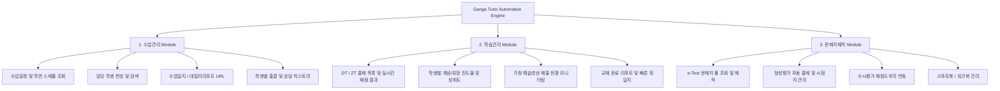

# 🚀 강의하는아이들 대치점 강사 자동화 시스템 (Tutor Automation Engine)

선생님의 강사 로그인 세션을 기반으로, 대치점 전용 학습사이트(`https://dc.gang-a.kr`)의 **수업관리, 학습관리, 문제지제작 3대 핵심 업무**를 파이썬 스크립트 및 CLI 명령어로 일괄 조회·자동화할 수 있는 전용 엔진 구축을 완료하였습니다.

---

## 🏛️ 1. 연결 및 강사 계정 식별 정보

- **대상 포털**: `https://dc.gang-a.kr` (강의하는아이들 대치점)
- **지점 번호 (fran_no)**: `1680` (대치 본원)
- **강사 고유 ID (pri_no)**: `1292923`
- **인증 상태**: ✅ **정상 인증 완료 (JSESSIONID 바인딩 성공)**
- **자동화 스크립트 경로**: [`tools/ganga_tutor_engine.py`](file:///C:/Users/packr/.gemini/antigravity/brain/43c4f235-4a3d-4aef-8c4e-d9bbbe6f1988/tools/ganga_tutor_engine.py)

---

## 🛠️ 2. 지원 모듈별 자동화 기능 및 연동 서블릿



### **1) 수업관리 (`class`)**
- `CourseScheduleServlet`: 강사별 요일/교시별 수업 시간표 및 배정 학반 조회
- `UserSearchServlet` / `CourseMemberServlet`: 담당 학반 학생 목록, 정회원/OT/편성대기 상태 조회
- `DayRecordServlet`: 일일 수업일지 작성 지원 및 학부모 발송용 데일리리포트 단축 URL 추출
- `AttendanceServlet` & `csl_student_list.jsp`: 출결 및 학생 상담 이력 관리

### **2) 학습관리 (`study`)**
- `DailyZeroTestServlet`: DT(데일리테스트) 및 ZT(제로테스트) 출제 현황, 학생별 점수 및 오답률 조회
- `CourseManageServlet`: 단원별 개념 진도현황표, 학생별 학습 스케줄 및 교재 정답지 연동
- `TeacherPrestudySummary` & `WebUnPreStudy`: 학생들의 개념노트 작성 및 셀프 개념설명 영상 업로드 여부 실시간 확인

### **3) 문제지제작 (`test`)**
- `TestPoolServlet` & `etest_pool.jsp`: e-Test 문제은행 기반 학년/단원/난이도별 맞춤 문제지 생성
- `TestPageListGrpServlet` & `TestPageRegServlet`: 형성평가(FA) 및 수시평가(NA) 시험지 출제 및 채점도우미 연동
- `WorkbookManageServlet`: 스마트북 워크북 조회 및 발행

---

## 💻 3. CLI 명령어 사용 방법

터미널이나 파이썬 코드에서 아래 명령어를 실행하여 원하는 업무 데이터를 즉시 추출하거나 자동화할 수 있습니다:

```bash
# 1. 3대 업무 전체 일괄 조회
python tools/ganga_tutor_engine.py all

# 2. 수업관리 모듈만 조회 (시간표, 학생, 출결, 수업일지)
python tools/ganga_tutor_engine.py class

# 3. 학습관리 모듈만 조회 (DT/ZT, 진도현황, 예습영상)
python tools/ganga_tutor_engine.py study

# 4. 문제지제작 모듈만 조회 (문제지 풀, 형성평가, 스마트북)
python tools/ganga_tutor_engine.py test

# 5. JSON 데이터로 출력 (파이프라인 연동 시)
python tools/ganga_tutor_engine.py all --json
```

---

## 🎯 4. 향후 자동화 확장 가능 시나리오

1. **"오늘 수업일지 템플릿 채워줘"**: 오늘 출석한 학생들의 진도와 과제 상태를 자동 수집하여 수업일지 초안 자동 작성
2. **"오늘 예습영상 안 올린 학생 누구야?"**: `TeacherPrestudySummary` 서블릿을 크롤링하여 미제출자 명단 즉시 추출
3. **"중2-1 일차부등식 형성평가 10문제 시험지 만들어줘"**: `TestPageRegServlet` 파라미터 전송을 통해 시험지 자동 생성
